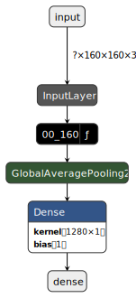
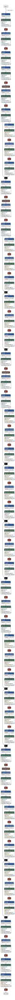
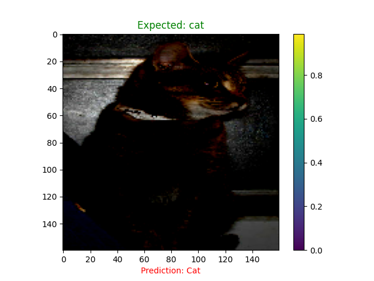
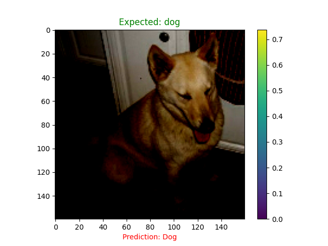

# Cat🐈‍⬛ vs. Dog🐕‍🦺 Image Classifier using Customized MobileNetV2 pre-trained model🔎
<table align="center" border=3>
  <tr>
    <td>
      

        
      

    </td>
  </tr>
</table>

In this project, we will build an image classifier to classify images of dogs and cats using a small dataset called `cats_vs_dogs` from the `tensorflow_datasets` module. The dataset contains (image, label) pairs, where images have different dimensions and three color channels.

## Getting Started

To get started with our project, follow these steps:

1. **Clone the Repository**: `git clone https://github.com/Asirwad/Image-Classifier-using-customised-MobileNetV2-Google.git`

2. **Install Dependencies**: Install the required dependencies by running `pip install -r requirements.txt`.

5. **Train the Models**: Run the training script to train the CNN models and ESRGAN: `python app\train.py`.

6. **Explore the Scripts**: Utilize the provided scripts to test the model: `python app\main.py`.

## Data Preprocessing

Since the sizes of the images in the dataset are different, we will create a function to resize all images to the same size for consistency.

## Picking a Pretrained Model - MobileNet V2

For our image classification task, we will use the MobileNet V2 model, developed by Google. We will only use the convolutional base of the model and exclude the top (classification) layer. This base_model will output a shape of `(32, 5, 5, 1280)`, representing feature extraction from the original `(1, 160, 160, 3)` image. The 32 indicates that we have 32 layers of different filters/features.

## Model Architecture

  

    

      🪄 <b>Customized model</b>
    

         
      

        <table>
          <tr>
            <td><b><i>Customized model</i></b></td>
          </tr>
          <tr>
            <td>
              

                
              

            </td>
          </tr>
      </table>
    

  

  

    

      🤖 <b>Base Model</b>
    

         
      

        <table>
          <tr>
            <td><b><i>MobileNetV2</i></b></td>
          </tr>
          <tr>
            <td>
              

                
              

            </td>
          </tr>
      </table>
    

  

## Adding the Classifier

Instead of flattening the feature map of the base layer, we will use a global average pooling layer. This layer averages the entire 5x5 area of each 2D feature map and returns a single 1280-element vector per filter.

We will fine-tune the model on our dogs vs. cats dataset to achieve accurate classifications.

## Scrutinizing the output

Based on the output of the single unit dense layer, we can determine whether the image is of a cat or a dog. If the value is less than zero, then the image is classified as a `cat`😼, but if it is greater than zero, then the image is classified as a `dog`🐶.

## Sample output
<table>
  <th>Output 1</th>
  <th>Output 2</th>
  <tr>
    <td>
      

          
      

    </td>
     <td>
      

          
      

    </td>
  </tr>
</table>

## Contributing

We welcome contributions from the open source community. If you find any issues or have suggestions for improvements, please feel free to open an issue or submit a pull request.

## Acknowledgements

We would like to acknowledge the following resources and libraries used in this project:

-  TensorFlow: [https://www.tensorflow.org/](https://www.tensorflow.org/)

## Contact

For any questions or inquiries, please contact us at [asirwadsali@gmail.com](mailto:asirwadsali@gmail.com).
